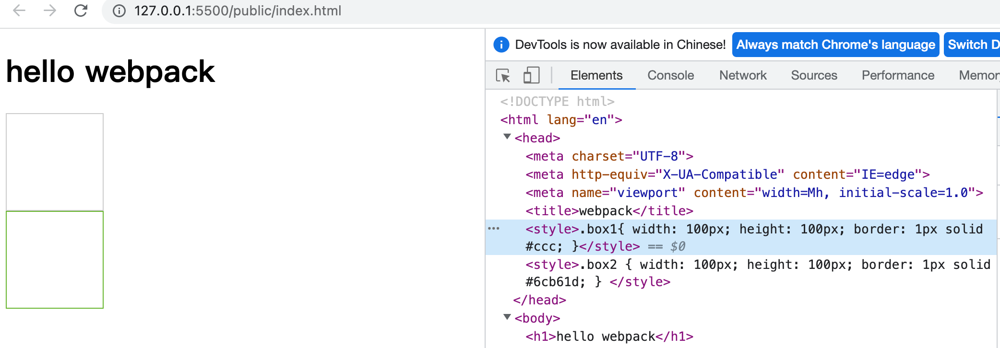

## Webpack5 学习


资料:
https://yk2012.github.io/sgg_webpack5/base/#%E4%B8%BA%E4%BB%80%E4%B9%88%E9%9C%80%E8%A6%81%E6%89%93%E5%8C%85%E5%B7%A5%E5%85%B7

视频:
https://www.bilibili.com/video/BV14T4y1z7sw/?p=3&spm_id_from=pageDriver&vd_source=14fedc3c63ed079cd9eb76b1b47d1f84


# 一 基础知识
## 1. 为什么需要打包工具？
开发时，我们会使用框架（React、Vue），ES6 模块化语法，Less/Sass 等 css 预处理器等语法进行开发。

这样的代码要想在浏览器运行必须经过编译成浏览器能识别的 JS、Css 等语法，才能运行。

所以我们需要打包工具帮我们做完这些事。

除此之外，打包工具还能**压缩代码**、做**兼容性处理**、**提升代码性能**等。


## 2. 基础使用 / 测试
Webpack 是一个静态资源打包工具。

**开发模式**：仅能编译 JS 中的 ES Module(import, export) 语法, 不能编译箭头函数, es6语法等

**生产模式**：能编译 JS 中的 ES Module 语法，还能压缩 JS 代码

如果直接访问页面html,不打包, 报如下错误:
```
Uncaught SyntaxError: Cannot use import statement outside a module (at main.js:1:1)
```
 


# 二 基本使用
可以使用webpack技术来解决上述问题

1. 初始化 package.json
```npm init -y ```
注意: "name": "webpack_code" 名称不能为webpack,否则因同名 下面的webpack包会下载失败.

2. 安装2个包: webpack webpack-cli(webpack 指令)
npm i webpack webpack-cli -D

3. 打包测试 (npx)
```npx webpack ./src/main.js --mode=development```
npx + webpack 包 + 入口文件 + 打包环境
生成dist文件, 里面的main.js 相对庞大. (106行)
```
dxm@bogon webpack_code % npx webpack ./src/main.js --mode=development
asset main.js 5.05 KiB [emitted] (name: main)
runtime modules 670 bytes 3 modules
cacheable modules 294 bytes
  ./src/main.js 116 bytes [built] [code generated]
  ./src/js/count.js 69 bytes [built] [code generated]
  ./src/js/sum.js 109 bytes [built] [code generated]
webpack 5.84.0 compiled successfully in 732 ms
dxm@bogon webpack_code %
```
 
```npx webpack ./src/main.js --mode=production```
生成dist文件, 里面的main.js被压缩. (1行)
```
dxm@bogon webpack_code % npx webpack ./src/main.js --mode=production 
asset main.js 86 bytes [emitted] [minimized] (name: main)
orphan modules 283 bytes [orphan] 2 modules
./src/main.js + 2 modules 399 bytes [built] [code generated]
webpack 5.84.0 compiled successfully in 840 ms
dxm@bogon webpack_code % 
```

4. 小结: 
* **npx说明: npx 会将 node_modules/.bin 临时添加为环境变量, 这样可以访问环境变量中的应用程序.**
* Webpack 本身功能比较少，只能处理 js 资源，一旦遇到 css 等其他资源就会报错。
* 主要学习如何处理其他资源


# 三 基本配置
五大核心
* entry（入口）指示 Webpack 从哪个文件开始打包

* output（输出）指示 Webpack 打包完的文件输出到哪里去，如何命名等

* loader（加载器）webpack 本身只能处理 js、json 等资源，其他资源需要借助 loader，Webpack 才能解析

* plugins（插件）扩展 Webpack 的功能

* mode（模式）
开发模式：development
生产模式：production


# 四 基本配置文件
编写**webpack.config.js**文件
执行 ```npx webpack```, 和上面执行```npx webpack ./src/main.js --mode=development```一样
```
const path = require("path"); //nodejs 核心模板, 专门用来处理路径问题

module.exports = {
    // 入口
    entry: './src/main.js', // 相对路径
    // 输出
    output: {
        // __dirname nodejs的变量, 代表当前文件夹目录
        path: path.resolve(__dirname, "dist"), // 绝对目录
        filename: 'main.js'
    },
    // 加载器
    module: {
        rules: [
            // loader 的配置
        ]
    },
    // 插件
    plugins: [
        // plugin的配置
    ],
    // 模式
    mode: "development",
}
```

# 五 处理css
### 处理css资源
npm install css-loader style-loader -D

### 处理less资源
npm install less less-loader --save-dev

### 处理sass资源
npm install sass-loader sass --save-dev

### 处理stylus资源
npm install stylus stylus-loader --save-dev

页面测试


# 六 处理 image
注意: 重复打包不会覆盖旧的, 需要删除旧的
图片
小于10kb 转为base 64 字符串
减少图片请求数量, 也就是减轻服务器压力.
缺点: 体积变大

```
{
    test: /\.(png|jpe?g|gif|svg|webp)/,
    type: 'asset',
    parser: {
        dataUrlCondition: {
        // 小于10kb的图片转base64
        // 优点: 减少请求数量
        // 缺点: 体积会更大
        maxSize: 10 * 1024 // 10kb
        }
    }
}
```