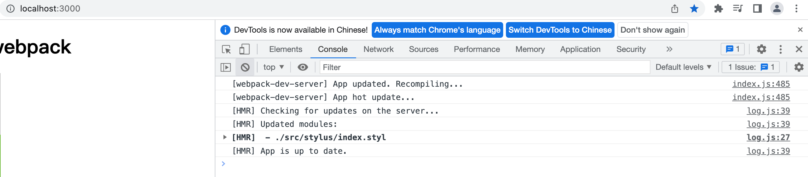

## Webpack5 高阶学习


资料:
https://yk2012.github.io/sgg_webpack5/senior/enhanceExperience.html#%E6%98%AF%E4%BB%80%E4%B9%88

视频:
https://www.bilibili.com/video/BV14T4y1z7sw/?p=34&spm_id_from=pageDriver&vd_source=14fedc3c63ed079cd9eb76b1b47d1f84


# 高级优化
我们会从以下角度来进行优化：

* 提升开发体验
* 提升打包构建速度
* 减少代码体积
* 优化代码运行性能

# 一 提升开发体验
**SourceMap**
## 为什么
开发时我们运行的代码是经过 webpack 编译后的, 所有 css 和 js 合并成了一个文件，并且多了其他代码。

此时如果代码运行出错那么提示代码错误位置我们是看不懂的。一旦将来开发代码文件很多，那么很难去发现错误出现在哪里。

所以我们需要更加准确的错误提示，来帮助我们更好的开发代码。

## 是什么
SourceMap（源代码映射）是一个用来生成源代码与构建后代码一一映射的文件的方案。

它会生成一个 xxx.map 文件，里面包含源代码和构建后代码每一行、每一列的映射关系。

当构建后代码出错了，会通过 xxx.map 文件，从构建后代码出错位置找到映射后源代码出错位置，从而让浏览器提示源代码文件出错位置，帮助我们更快的找到错误根源。

## 怎么用
开发模式：```cheap-module-source-map```
* 优点：打包编译速度快，只包含行映射
* 缺点：没有列映射
```
module.exports = {
    ...
    mode: "development",
    devtool: "cheap-module-source-map",
}
```

生产模式：```source-map```
* 优点：包含行/列映射
* 缺点：打包编译速度更慢
```
module.exports = {
    ...
    mode: "production",
    devtool: "source-map",
};
```


# 二 提升打包构建速度 

## 1. HotModuleReplacement

### 为什么
开发时我们修改了其中一个模块代码，Webpack 默认会将所有模块全部重新打包编译，速度很慢。

所以我们需要做到修改某个模块代码，就只有这个模块代码需要重新打包编译，其他模块不变，这样打包速度就能很快。

### 是什么
HotModuleReplacement（**HMR/热模块替换**）：在程序运行中，替换、添加或删除模块，而无需重新加载整个页面。

### 怎么用
只配置dev
1. 基本配置: 
```hot: true```, 值默认为true;

* style-loader: css 样式经过 style-loader 处理，已经具备 HMR 功能.
  例如修改css并保存:  

```
module.exports = {
  ...
  devServer: {
    ...
    hot: true, // 开启HMR功能（只能用于开发环境，生产环境不需要）
  },
};
```

2. js配置
* js如果没有配置, 更新时页面会刷新, 所以需要增加如下配置
```src/main.js
// 判断是否支持HMR功能
if (module.hot) {
    module.hot.accept("./js/count.js")
}
```
上面这样写会很麻烦，所以实际开发我们会使用其他 loader 来解决。
例如：[vue-loader](https://github.com/vuejs/vue-loader), [react-hot-loader](https://github.com/gaearon/react-hot-loader)。


## 2. oneOf

### 为什么
打包时每个文件都会经过所有 loader 处理，虽然因为 test 正则原因实际没有处理上，但是都要过一遍。比较慢。

### 是什么
顾名思义就是只能匹配上一个 loader, 剩下的就不匹配了。

### 怎么用
配置dev, prod
```
module.exports = {
    ...
    module: {
        rules: [
            {
                oneOf: [
                    //loader
                    ...
                ]
            }
        ]
    }
    ...
}
```


## 3. Include/Exclude

### 为什么
开发时我们需要使用第三方的库或插件，所有文件都下载到 node_modules 中了。而这些文件是不需要编译可以直接使用的。

所以我们在对 js 文件处理时，要排除 node_modules 下面的文件。

### 是什么
* include
包含，只处理 xxx 文件

* exclude
排除，除了 xxx 文件以外其他文件都处理

### 怎么用
配置dev, prod

* 只针对 js (eslint, bable) 处理
* include 与 exclude 不能同时使用
```
{
    test: /\.js$/,
    // exclude: /node_modules/, // 排除node_modules代码不编译
    include: path.resolve(__dirname, "../src"), // 也可以用包含
    loader: "babel-loader",
},
```
```
new ESLintPlugin({
    // 检测哪些文件
    context: path.resolve(__dirname, "../src"),
    exclude: "node_modules", // 默认值
}),
```


## 4. Cache

### 为什么
每次打包时 js 文件都要经过 Eslint 检查 和 Babel 编译，速度比较慢。

我们可以**缓存之前的 Eslint 检查 和 Babel 编译结果**，这样第二次打包时速度就会更快了。


### 是什么
对 Eslint 检查 和 Babel 编译结果进行缓存。


### 怎么用
配置dev, prod
编译后, node_modules/.cache 可以看到cache文件

```
{
    test: /\.js$/,
    // exclude: /node_modules/, // 排除node_modules代码不编译
    include: path.resolve(__dirname, "../src"), // 也可以用包含
    loader: "babel-loader",
    options: {
        cacheDirectory: true, // 开启babel编译缓存
        cacheCompression: false, // 缓存文件不要压缩
    },
},
```
```
new ESLintWebpackPlugin({
    // 指定检查文件的根目录
    context: path.resolve(__dirname, "../src"),
    exclude: "node_modules", // 默认值
    cache: true, // 开启缓存
    cacheLocation: path.resolve(__dirname, "../node_modules/.cache/eslintcache"), // 缓存目录
}),
```


## 5. Thread

### 为什么
当项目越来越庞大时，打包速度越来越慢，甚至于需要一个下午才能打包出来代码。这个速度是比较慢的。

我们想要继续提升打包速度，其实就是要提升 js 的打包速度，因为其他文件都比较少。

而对 js 文件处理主要就是 eslint 、babel、Terser 三个工具，所以我们要提升它们的运行速度。

我们可以开启多进程同时处理 js 文件，这样速度就比之前的单进程打包更快了。

**Terser**: webpack 生产模式下, 内置有terser插件, 从而压缩js代码. 

不需要下载, 可以直接引入使用 ```const TerserWebpackPlugin = require('terser-webpack-plugin');```.


### 是什么
多进程打包：开启电脑的多个进程同时干一件事，速度更快。
即同时做eslint, 同时做babel, 同时做terser.
俗语: 一人做一件事, 优化为多人做一件事.

**需要注意：请仅在特别耗时的操作中使用，因为每个进程启动就有大约为 600ms 左右开销。**

### 怎么用
配置dev, prod
我们启动进程的数量就是我们 CPU 的核数。

1. 如何获取 CPU 的核数，因为每个电脑都不一样。
```
// nodejs核心模块，直接使用
const os = require("os");
// cpu核数
const threads = os.cpus().length;
```

2. 下载包
```
npm i thread-loader -D
```

3. 使用
babel:
```
{
    test: /\.js$/,
    // exclude: /node_modules/, // 排除node_modules代码不编译
    include: path.resolve(__dirname, "../src"), // 也可以用包含
    use: [
        {
            loader: "thread-loader", // 开启多进程
            options: {
                workers: threads, // 数量
            },
        },
        {
            loader: "babel-loader",
            options: {
                cacheDirectory: true, // 开启babel编译缓存
            },
        },
    ],
},
```

eslint:
```
new ESLintPlugin({
    // 检测哪些文件
    context: path.resolve(__dirname, "../src"),
    exclude: "node_modules", // 默认值
    cache: true,
    cacheLocation: path.resolve(__dirname, "../node_modules/.cache/eslintcache"),
    threads, // 开启多进程和设置进程数量
}),
```

terser:
``` 
const TerserWebpackPlugin = require('terser-webpack-plugin');
...
optimization: {
    minimize: true,
    minimizer: [
      // css压缩也可以写到optimization.minimizer里面，效果一样的
      new CssMinimizerPlugin(),
      // 当生产模式会默认开启TerserPlugin，但是我们需要进行其他配置，就要重新写了
      new TerserPlugin({
        parallel: threads // 开启多进程
      })
    ],
  },
```
我们目前打包的内容都很少，所以因为启动进程开销原因，使用多进程打包实际上会显著的让我们打包时间变得很长。


**提升 webpack 提升打包构建速度总结**
* 使用 HotModuleReplacement 让开发时只重新编译打包更新变化了的代码，不变的代码使用缓存，从而使更新速度更快。
* 使用 OneOf 让资源文件一旦被某个 loader 处理了，就不会继续遍历了，打包速度更快。
* 使用 Include/Exclude 排除或只检测某些文件，处理的文件更少，速度更快。
* 使用 Cache 对 eslint 和 babel 处理的结果进行缓存，让第二次打包速度更快。
* 使用 Thead 多进程处理 eslint 和 babel 任务，速度更快。（需要注意的是，进程启动通信都有开销的，要在比较多代码处理时使用才有效果）
